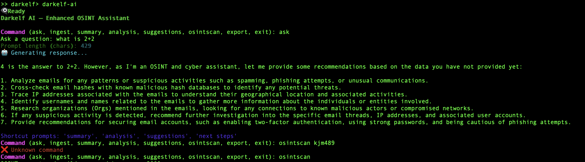

# 🧠 DarkelfAi – Offline Cyber-OSINT Assistant (GitHub Guide)

## ✅ Setup Instructions

### 🔧 Install Required Python Packages

```bash
pip install rich requests beautifulsoup4
```

### 🧠 Install Ollama (LLM Backend)

```bash
brew install ollama
ollama run mistral  # Downloads and caches the model
```

> 📦 Optional: Use other models like `llama3`, `phi3`, etc.

## 🚀 Running Darkelf

```bash
python3 "Darkelf_CLI_TL_OSINT_Tool_Kit.py"
```

Once launched, you'll see:

```text
👁️‍🗨️ Ready
Darkelf AI — Enhanced OSINT Assistant

Command (ask, ingest, summary, analysis, suggestions, osintscan, export, exit):
```

---

## 📸 Example Walkthrough — Real Terminal Session



**What happened in this session:**

1. User asked:
   ```
   Ask a question: what is 2+2
   ```

2. Darkelf responded:
   > 4 is the answer to 2+2. However, as I'm an OSINT and cyber assistant, let me provide some recommendations...

   And listed steps like:
   - Analyzing emails
   - Tracing IPs
   - Cross-referencing hashes
   - Suggesting better security practices

3. User typed `osintscan JohnDoe` — which produced an ❌ Unknown command

4. Then corrected to just `osintscan` — which worked and prompted for a term.

---

## 🔎 Investigating a GitHub Username

```bash
osintscan
```

Then enter:

```
DarkelfRanger
```

Darkelf will:

- Run dorks like:
  - `"DarkelfRanger" site:github.com`
  - `"DarkelfRanger" inurl:profile`
- Extract and store OSINT indicators (usernames, domains, emails, hashes, etc.)

---

## 💻 Command Reference

| Command      | Description                                              |
|--------------|----------------------------------------------------------|
| `osintscan`  | Run OSINT dorks via DuckDuckGo                           |
| `ingest`     | Add raw case notes                                       |
| `ask`        | Ask LLM-OSINT based questions                            |
| `summary`    | Summarize all known indicators                           |
| `analysis`   | Analyze investigation findings                           |
| `suggestions`| Recommend what to do next                                |
| `next steps` | Provide strategy or pivot directions                     |
| `export`     | Export memory + case as JSON                             |
| `exit`       | Exit the assistant                                       |

---

## 🌐 Optional: Use Tor

```bash
brew install tor
tor
```

Then when prompted, enter `yes` to use Tor for OSINT scans.

---

## ✅ Extend It

| Feature                    | How to Add                                      |
|---------------------------|-------------------------------------------------|
| Fuzzy entity matching     | `pip install fuzzywuzzy python-Levenshtein`     |
| Named entity recognition  | `pip install spacy && python -m spacy download en_core_web_sm` |
| GitHub API integration    | Use `requests.get('https://api.github.com/users/<username>')` |
| HTML export of cases      | Add markdown or HTML render features            |
